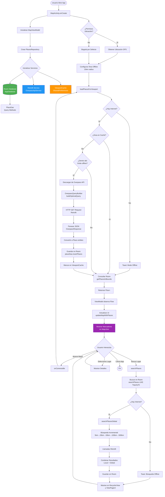
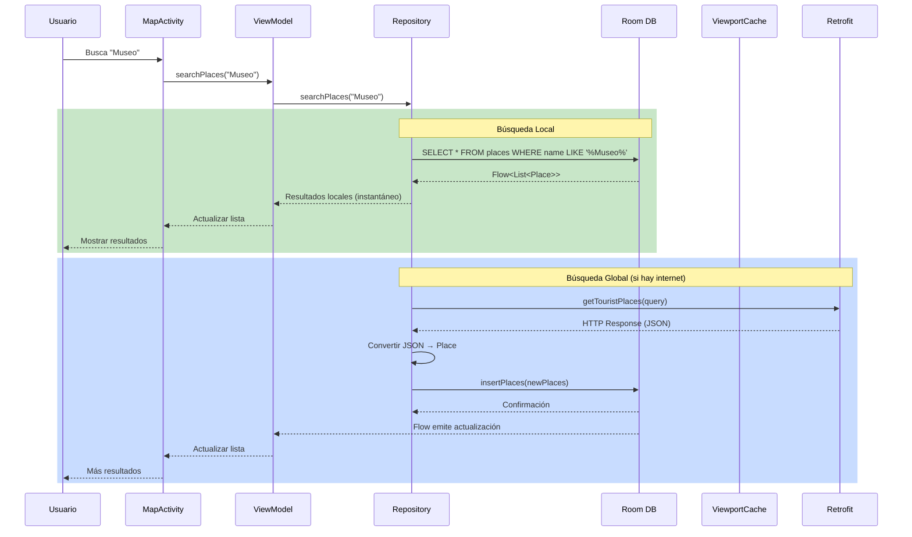

## **Diagrama de Flujo de Trabajo**



## **Integración ROOM + Retrofit - Explicación Detallada**

### **1. Arquitectura del Sistema** 

```
┌─────────────────────────────────────────────────────────────┐
│                         UI LAYER                            │
│  ┌────────────────┐          ┌────────────────────────┐    │
│  │  MapActivity   │◄────────►│     MapViewModel       │    │
│  │  (View)        │          │  (LiveData/StateFlow)  │    │
│  └────────────────┘          └───────────┬────────────┘    │
└──────────────────────────────────────────┼──────────────────┘
                                           │
┌──────────────────────────────────────────┼──────────────────┐
│                    REPOSITORY LAYER      │                  │
│                  ┌──────────────────────▼────────────────┐  │
│                  │    PlacesRepository                   │  │
│                  │  (Coordinador Central)                │  │
│                  └─┬────────────────────────────────┬────┘  │
└────────────────────┼────────────────────────────────┼───────┘
                     │                                │
        ┌────────────▼──────────┐       ┌───────────▼──────────┐
        │   LOCAL DATA SOURCE   │       │  REMOTE DATA SOURCE  │
        │                       │       │                      │
        │  ┌─────────────────┐  │       │  ┌────────────────┐ │
        │  │  Room Database  │  │       │  │ OverpassAPI    │ │
        │  │  (AppDatabase)  │  │       │  │ (Retrofit)     │ │
        │  └────────┬────────┘  │       │  └───────┬────────┘ │
        │           │            │       │          │          │
        │  ┌────────▼────────┐  │       │  ┌───────▼────────┐ │
        │  │   PlaceDao      │  │       │  │ OverpassApi    │ │
        │  │  (Query/Insert) │  │       │  │    Service     │ │
        │  └─────────────────┘  │       │  └────────────────┘ │
        └───────────────────────┘       └─────────────────────┘
```

### **2. Flujo de Integración ROOM ↔ Retrofit**

#### ** Descarga de Datos (Online)**

```kotlin
// PASO 1: Repository recibe solicitud de datos
suspend fun getPlacesInViewport(boundingBox: BoundingBox): Flow<List<Place>> {
    
    // PASO 2: Verificar si el área ya está en caché
    val isCached = viewportCache.isAreaCached(...)
    
    if (!isCached && isNetworkAvailable) {
        // PASO 3: RETROFIT - Descargar de Overpass API
        val query = OverpassQueryBuilder.buildOptimalQuery(boundingBox)
        val response = overpassService.getTouristPlaces(query) // HTTP Call
        
        if (response.isSuccessful) {
            val elements = response.body()?.elements ?: emptyList()
            
            // PASO 4: Convertir JSON → Room Entities
            val places = elements.mapNotNull { element ->
                convertOverpassElementToPlace(element) // JSON → Place
            }
            
            // PASO 5: ROOM - Guardar en base de datos local
            placeDao.insertPlaces(places) // Persistencia
            
            // PASO 6: Marcar área como cacheada
            viewportCache.markAreaAsCached(...)
        }
    }
    
    // PASO 7: SIEMPRE retornar datos de ROOM (única fuente de verdad)
    return placeDao.getPlacesInBounds(...) // Flow<List<Place>>
}
```

#### ** Lectura de Datos (Online/Offline)**

```kotlin
// El ViewModel observa un Flow de Room
viewModelScope.launch {
    repository.getPlacesInViewport(boundingBox).collect { places ->
        // Room emite automáticamente cuando hay cambios
        _places.value = places
        applyFilters()
    }
}
```

### **3. Configuración de Room** 

```kotlin
// Entity - Definición de tabla
@Entity(tableName = "places")
data class Place(
    @PrimaryKey val id: String,
    val name: String,
    val type: String,
    val lat: Double,
    val lon: Double,
    val description: String?,
    val address: String?,
    @ColumnInfo(name = "created_at") val createdAt: Long = System.currentTimeMillis()
)

// DAO - Operaciones de base de datos
@Dao
interface PlaceDao {
    // Consulta con Flow para actualizaciones reactivas
    @Query("""
        SELECT * FROM places 
        WHERE lat BETWEEN :minLat AND :maxLat 
        AND lon BETWEEN :minLon AND :maxLon
    """)
    fun getPlacesInBounds(
        minLat: Double, maxLat: Double,
        minLon: Double, maxLon: Double
    ): Flow<List<Place>>
    
    // Inserción con conflicto de reemplazo
    @Insert(onConflict = OnConflictStrategy.REPLACE)
    suspend fun insertPlaces(places: List<Place>)
    
    // Búsqueda por nombre
    @Query("SELECT * FROM places WHERE name LIKE '%' || :query || '%'")
    fun searchPlaces(query: String): Flow<List<Place>>
}

// Database - Singleton
@Database(entities = [Place::class], version = 1)
abstract class AppDatabase : RoomDatabase() {
    abstract fun placeDao(): PlaceDao
    
    companion object {
        @Volatile
        private var INSTANCE: AppDatabase? = null
        
        fun getDatabase(context: Context): AppDatabase {
            return INSTANCE ?: synchronized(this) {
                Room.databaseBuilder(
                    context.applicationContext,
                    AppDatabase::class.java,
                    "places_database"
                ).build().also { INSTANCE = it }
            }
        }
    }
}
```

### **4. Configuración de Retrofit** 

```kotlin
// API Service Interface
interface OverpassApiService {
    @GET("interpreter")
    suspend fun getTouristPlaces(
        @Query("data") query: String
    ): Response<OverpassResponse>
}

// Network Module - Creación del servicio
object NetworkModule {
    fun createOverpassService(context: Context): OverpassApiService {
        val retrofit = Retrofit.Builder()
            .baseUrl("https://overpass-api.de/api/")
            .client(createOkHttpClient(context, timeoutSeconds = 60))
            .addConverterFactory(GsonConverterFactory.create())
            .build()
        
        return retrofit.create(OverpassApiService::class.java)
    }
    
    private fun createOkHttpClient(context: Context, timeoutSeconds: Long): OkHttpClient {
        return OkHttpClient.Builder()
            .connectTimeout(timeoutSeconds, TimeUnit.SECONDS)
            .readTimeout(timeoutSeconds, TimeUnit.SECONDS)
            .addInterceptor(HttpLoggingInterceptor().apply {
                level = HttpLoggingInterceptor.Level.BODY
            })
            .cache(Cache(File(context.cacheDir, "http_cache"), 10 * 1024 * 1024L))
            .build()
    }
}

// Response Models
data class OverpassResponse(
    val elements: List<OverpassElement>
)

data class OverpassElement(
    val id: Long,
    val lat: Double?,
    val lon: Double?,
    val tags: Map<String, String>?,
    val center: OverpassCenter?
)
```

### **5. Conversión JSON → Room Entity** 

```kotlin
private fun convertOverpassElementToPlace(element: OverpassElement): Place? {
    // Extraer coordenadas
    val lat = element.lat ?: element.center?.lat ?: return null
    val lon = element.lon ?: element.center?.lon ?: return null
    
    // Extraer tags
    val tags = element.tags ?: return null
    val name = tags["name"] ?: "Sin nombre"
    
    // Determinar tipo
    val placeType = determinePlaceTypeExtended(tags)
    
    // Construir descripción
    val description = buildDescriptionExtended(tags, placeType)
    
    // Construir dirección
    val address = buildAddress(tags)
    
    // Crear entidad de Room
    return Place(
        id = "osm_${element.id}",
        name = name,
        type = placeType,
        lat = lat,
        lon = lon,
        description = description,
        address = address
    )
}
```

### **6. Ventajas de esta Integración** 

| Característica | Beneficio |
|----------------|-----------|
| **Single Source of Truth** | Room es la única fuente de verdad; la UI solo lee de ahí |
| **Offline First** | La app funciona completamente sin internet si hay datos cacheados |
| **Reactive Updates** | Flow de Room emite automáticamente cuando hay cambios |
| **Caché Inteligente** | ViewportCache evita descargas redundantes |
| **Separación de Responsabilidades** | Retrofit para red, Room para persistencia, Repository coordina |
| **Type Safety** | Kotlin data classes con validación en compile-time |
| **Coroutines** | Operaciones asíncronas sin bloquear UI |

### **7. Diagrama de Secuencia - Búsqueda con Cache**



## **Resumen de la Integración**

### **Room (Persistencia Local)**
- Almacena datos de forma estructurada en SQLite
- Proporciona Flows reactivos que emiten cuando hay cambios
- Permite consultas SQL type-safe con anotaciones
- Única fuente de verdad para la UI

### **Retrofit (Cliente HTTP)**
- Realiza llamadas HTTP a Overpass API
- Convierte JSON automáticamente a Kotlin objects (Gson)
- Maneja errores de red y timeouts
- Solo se usa cuando hay internet

### **Repository (Coordinador)**
- Decide cuándo usar Retrofit (descarga) vs Room (lectura)
- Implementa lógica de caché inteligente
- Convierte entre modelos de API y entidades de Room
- Expone Flows a los ViewModels

Este patrón se conoce como **"Offline First Architecture"** y es la práctica recomendada por Google para apps Android modernas! 